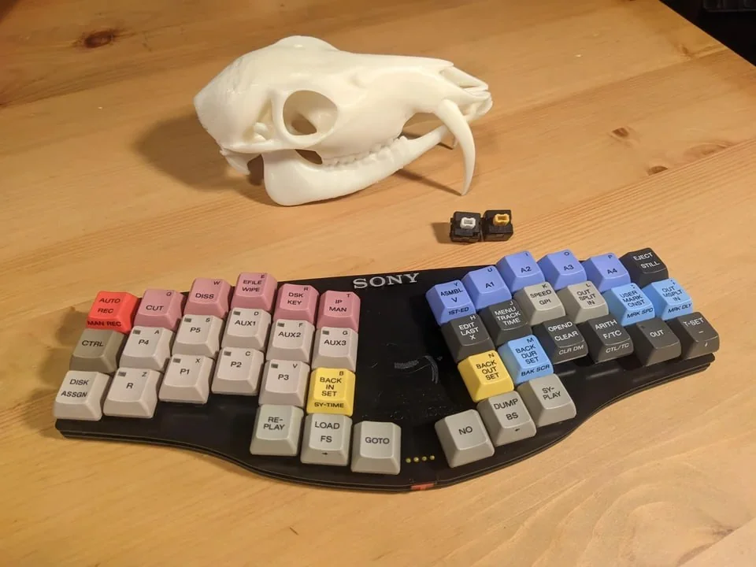
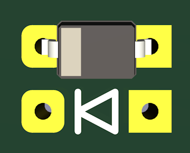
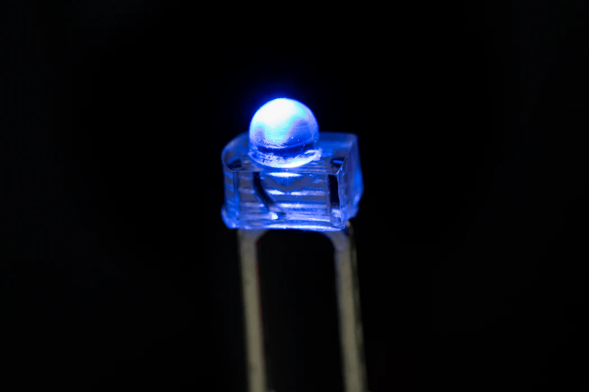
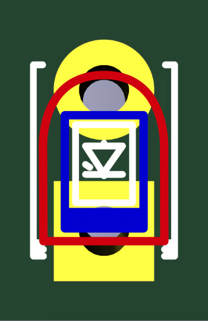

# Wanderer
Wanderer is a wireless ultra low profile unibody 40% keyboard.  

  

---

## Main Features:  
* ultra low profile switches
* 3x6+3 unibody layout
* Bluetooth support
* 4 status LEDs
* Large battery capacity (500–800 mAh depending on the type of switches used)
* [ZMK firmware](https://github.com/aroum/zmk-kabarga)

---

## ZMK Firmware  
ZMK firmware configuration with status indicator support is available for download [here](https://github.com/aroum/zmk-kabarga).  

---

# Assembly Order:

Before starting assembly, read everything on this page. Since Kabarga supports a vast number of build variations, many details need to be explained for each component. Additionally, note that both the plate and bottom case have two sides with different designs—you can choose either during assembly. 

* Solder the diodes.
* Solder the reset button.
* Solder the power switch.
* Solder the resistors.
* Solder the MCU.
* If using hot-swap sockets, solder them at this stage.
* If using SMD LEDs, solder them at this stage.
* Clean the PCB from flux residue.
* Attach the standoffs to the plate. If desired, you can use silicone flat gaskets.
* If using through-hole LEDs, insert them into the PCB but do not solder them yet.
* Connect the plate, standoffs, and PCB together.
* Install the switches into the plate, starting from the corners.
* If not using hot-swap sockets, solder the switches.
* If using through-hole LEDs, press them against the plate, solder them, and trim the leads.
* Attach the battery to the plate using double-sided tape, then solder its leads to the PCB.
* Screw on the bottom case. If desired, you can use silicone flat gaskets.
* Attach the rubber feet.
* Press the reset button twice and flash the bootloader.
* Press the reset button twice again and flash the firmware.

---

## BOM:  
### Electronic components:
| Component          | Kabarga                    | Kabarga CE             | Note |
| ------------------ | -------------------------- | ---------------------- | ---- |
| Reset              | EVQP7C01K                  | EVQP7C01K              |      |
| MCU                | nice!nano v2               | nice!nano v2           |      |
| Diodes             | 1N4148WS T4         42 pcs | 1N4148WS T4     42 pcs |      |
| Power switch       | BSI-10H                    | BSI-10H/MSK-12C02      |      |
| Battery            | X03035                     | X03035                 |      |
| LEDs               | 1.8mm                4 pcs | 0603 / 1.8mm     4 pcs |      |
| Resistors          | 0603 1-10k           4 pcs | 0603 1-10k       4 pcs |      |
| Underglow RGB LEDs | Not supported              | YS-SK6812MINI-E 42 pcs |      |
| Keyboard switches  | Аny supported type  42 pcs | MX/KS-33        42 pcs |      |
| Hotswap sockets    | Not supported              | MX/KS-33        42 pcs |      |

### Mechanical parts:
| Component            | Standard           | Flex              | Note     |
| -------------------- | ------------------ | ----------------- | -------- |
| PCB                  | Any                | Kabarga v2+ or CE |          |
| Top                  | Any                | Any               |          |
| Bottom               | Standard           | Flex              |          |
| Spacers              | m2          12 pcs | m2          8 pcs |          |
| Screws               | m2x4 T5     24 pcs | m2x4 T5    16 pcs |          |
| Silicone flat gasket | 2x5x1mm  12-24 pcs | 2x5x1mm  8-16 pcs | Optional |
| Bumpons              | 8x1.5+mm    10 pcs | 8x2.5+mm   10 pcs |          |

### Reset: 
The EVQP7C01K has a thickness of 1.5 mm, so when using KS-27/33, the reset button must be soldered on the underside of the PCB. In all other cases, it can be soldered on either side, but soldering it under the plate is recommended.

### MCU:
You can use any ProMicro-compatible MCU. Currently, ZMK firmware is available, but you can port QMK yourself if needed.

The standard Kabarga PCB is essentially reversible, meaning it can be assembled from either side. However, it is recommended to assemble it with the MCU facing downward, under the PCB.

The table shows the recommended installation method, but in some versions, you can mount the MCU on the underside of the PCB. If you're unsure about the installation, you can use a multimeter to check the position of the GND pads by placing one probe on the "-" pad for the battery.

| Variant    | Mounting Side               |
| ---------- | --------------------------- |
| Kabarga    | Facing up under the PCB     |
| Kabarga CE | Facing down under the plate |

### Spacers:
If you are not using hot-swap, you can trim the switch pins and make the keyboard lower by using shorter spacers. You can also use thinner PCBs, such as 1.2 mm, gaining an additional 0.4 mm.  

If you are building a flex variant, you need to use standoffs that are 1-2 mm longer to allow space for the PCB to move freely.

| Switch             | Height |
| ------------------ | ------ |
| MX                 | 8      |
| MX (Hotswap)       | 8      |
| KS-27/33           | 6      |
| KS-27/33 (Hotswap) | 6      |
| Hi-TEK 725         | 8      |
| Omron B3G-S        | 7      |
| Alps SKCC/SKCM     | 7      |

### Diodes:
  

Any SOD-323 diodes can be used. You can solder diodes on either side of the PCB, just make sure to follow the polarity shown in the diagram. However, the distance from the plate to the PCB in KS-27/33 is 1.2 mm, while the height of the diodes is 0.9 mm. This means you need to solder very carefully or place the diodes on the underside of the PCB. If you are not using hot-swap sockets and want to build the thinnest possible version by cutting all leads flush, you will likely prefer to solder the diodes under the plate.

### Power Switches:  
The MSK-12C02 was only used in the Kabarga CE V1.0. Since the distance from the PCB to the plate in KS-27/33 is 1.2 mm, the BSI-10H, with a thickness of 2.5 mm, didn’t fit. Mounting it on the underside was possible, but it required increasing the standoff height by 1 mm. That’s why we wanted to use the MSK-12C02, but it wasn’t a very reliable switch. Additionally, in later versions, the idea emerged to move the BSI-10H forward for compatibility with a 3D-printed case. Because of this, support for the MSK-12C02 was dropped.

In most cases, the BSI-10H should be soldered under the plate, but for keyboards using the KS-27/33, it must be soldered on the underside of the PCB.

### Battery:  
X03035, where X is the battery thickness in mm. The recommended battery thickness for the standard build is the standoff height minus 1 mm—it's not good to squeeze the battery between the plate and the bottom. You can always use a thinner battery. The battery should be attached to the plate using double-sided tape.

| Switch             | Battery |
| ------------------ | ------- |
| MX                 | 603035  |
| MX (Hotswap)       | 603035  |
| KS-27/33           | 503035  |
| KS-27/33 (Hotswap) | 503035  |
| Hi-TEK 725         | 603035  |
| Omron B3G-S        | 603035  |
| Alps SKCC/SKCM     | 603035  |

### LEDs:
  

The first three LEDs from the left indicate the battery level and the current BT profile. The rightmost LED signals a lost BT connection. In reality, the LED indicators can show much more, but this will be detailed later. You can use LEDs of the same or different colors, but keep in mind that different colors require different resistors, so balancing brightness across colors may be challenging.

SMD 0603 LEDs are used only for KS-27/33 since through-hole LEDs don’t fit under the plate due to their height. Through-hole LEDs are simply inserted into the holes during assembly. After installing the switches, you can solder the LED leads and trim them. Make sure each LED is properly aligned with the hole in the plate.

Through-hole LEDs (red on pic) should be soldered so that the rounded part of their casing aligns with the round pad on the PCB. On an SMD LED (blue on pic) , the stripe on the top of the casing should align with the square pad on the PCB.

### Resistors:
Resistors should be 1kΩ or higher, with the exact value depending on the color of the LEDs you are using. The maximum brightness of indicator LEDs can be adjusted in the firmware configuration file.

### case:

coming soon...
