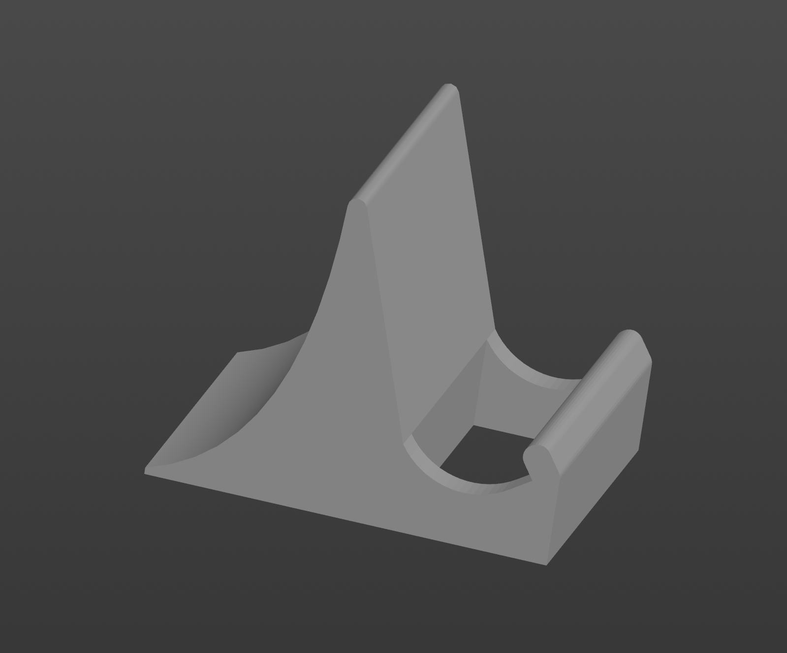

# KABARGA  
KABARGA is a wireless unibody 40% keyboard.  

  

---

## Main Features:  
* 42 switches (supports multiple types, see below)
* Easily accessible power switch and reset button 
* Bluetooth support
* Per switch RGB LED (CE only)     
* Hotswap (CE only)
* 4 status LEDs
* Large battery capacity (500–800 mAh depending on the type of switches used)
* [ZMK firmware](https://github.com/aroum/zmk-kabarga)

---

## ZMK Firmware  
ZMK firmware configuration with status indicator support is available for download [here](https://github.com/aroum/zmk-kabarga).  

---

## Versions:  
### Kabarga  
The standard version with support for multiple switch types, as listed below.  

### Kabarga CE (Civil Edition)  
This version adds per switch RGB and hot-swap support for KS-27/33 and MX switches, making it more versatile and user-friendly.  

---

## Supported Switches:  
* i-Rocks [not tested].  
* Cherry MX.  
* SMK 2nd gen [not tested].  
* KS-27/33.  
* Futaba MA.  
* Hi-Tek 725.  
* Omron B3G-S.  
* Alps SKCC/SKCM.  

---

## Stand:  
  

I also made a stand for vertical keyboard storage on a shelf. You can download the STEP file [here](stand\kabarga_stand.stp). This is a modification of this [project](https://www.thingiverse.com/thing:50544). 